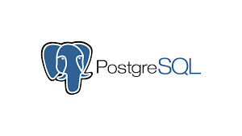
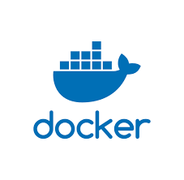
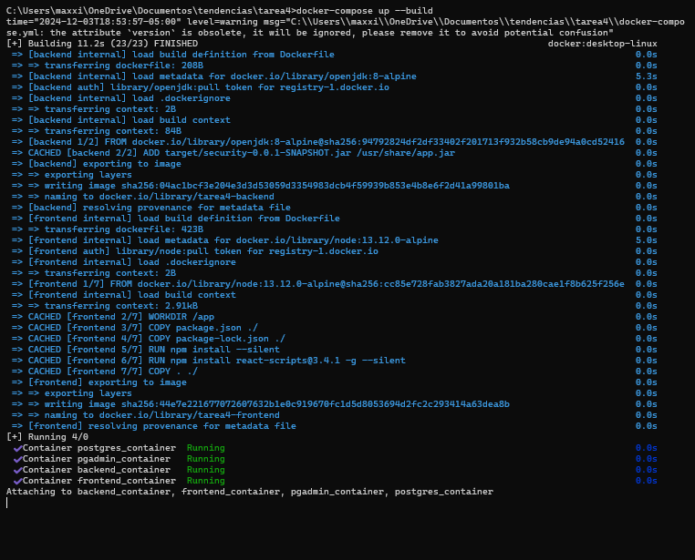
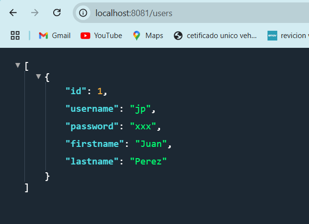

# PRÁCTICA DE CONTENEDORES POSTGRESQL

## 1. Título
Desarrollo de un sistema Backend y Frontend usando contenedores Docker, PostgreSQL y PgAdmin.

## 2. Tiempo de duración
Para esta práctica se realizo en una duración de 3 horas aproximadamente 

## 3. Fundamentos:

PostgreSQL: es un sistema de gestión de bases de datos relacional de código abierto, conocido por su robustez, escalabilidad y cumplimiento de estándares SQL.

Figura 1: Logo de PostgreSQL

Docker: es una plataforma que permite la creación y ejecución de aplicaciones en contenedores. Un contenedor es una instancia ligera y portátil que incluye todo lo necesario para que una aplicación funcione, como el código, las librerías y las configuraciones.

Figura 2: Logo de Docker

PgAdmin:
PgAdmin es una herramienta de administración para PostgreSQL, que permite gestionar la base de datos a través de una interfaz gráfica.

## 4. Conocimientos previos
Para esta práctica es importante el conocimiento de los siguientes temas:

- Comandos básicos de Linux: Interacción con la terminal, navegación y uso de permisos
- Conceptos básicos de Docker: Imágenes, contenedores y volúmenes
- Conocimientos de SQL y bases de datos relacionales para interactuar con PostgreSQL
- Conocimientos básicos de frontend y backend: React para el frontend y una API backend en Java.

## 5. Objetivos a alcanzar

- Crear contenedores para PostgreSQL y Maven.
- Configurar el contenedor PostgreSQL con persistencia de datos usando volúmenes de Docker.
- Implementar y probar la conexión entre el frontend, backend y base de datos.
- Crear redes Docker para comunicación entre los contenedores.

## 6. Equipo necesario

- Computador con sistema operativo Windows/Linux/Mac
- Cuenta en Docker Play (correo institucional)
- Editor de texto como Visual Studio Code o cualquier otro.

## 7. Material de apoyo

- Documentación oficial de Docker
- Documentación oficial de PostgreSQL

## 8. Procedimiento

Paso 1: Se edito el archivo docker-compose.yml  que define los servicios de PostgreSQL, PgAdmin, Frontend y Backend. Se establecieron las redes y los volúmenes necesarios.

Figura 4: Archivo compose.

Paso 2: En la terminal se debe colocar docker-compose up -d para descargar los contenedores para que asi se guarde el codigo y los datos que hemos colocado en el yml.

Figura 5: Comandos.

Paso 3: Una vez descargado los contenedores en el directorio donde se encuentra el yml en la terminal tenemos que colocar el comando docker-compose up --build para que se cargen los contenedores

Figura 6: Contenedores

## 9. Resultados esperados:
    
Al finalizar la práctica, se pudo correr los dos en diferentes contenedores, se puedo tener una conexion entre los dos servicios.

Figura 9: Paginas

## 10. Bibliografía

- Docker: Accelerated Container Application Development. (2024). Docker. https://www.docker.com/
- PostgreSQL: The World's Most Advanced Open Source Relational Database. (2024). PostgreSQL. https://www.postgresql.org/
- React Documentation. https://reactjs.org/docs/getting-started.html

